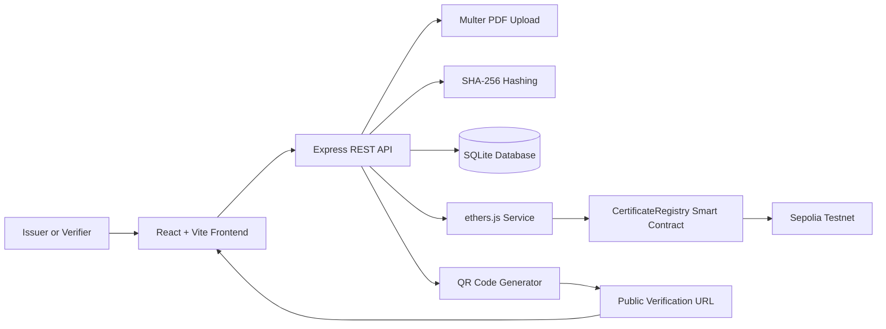
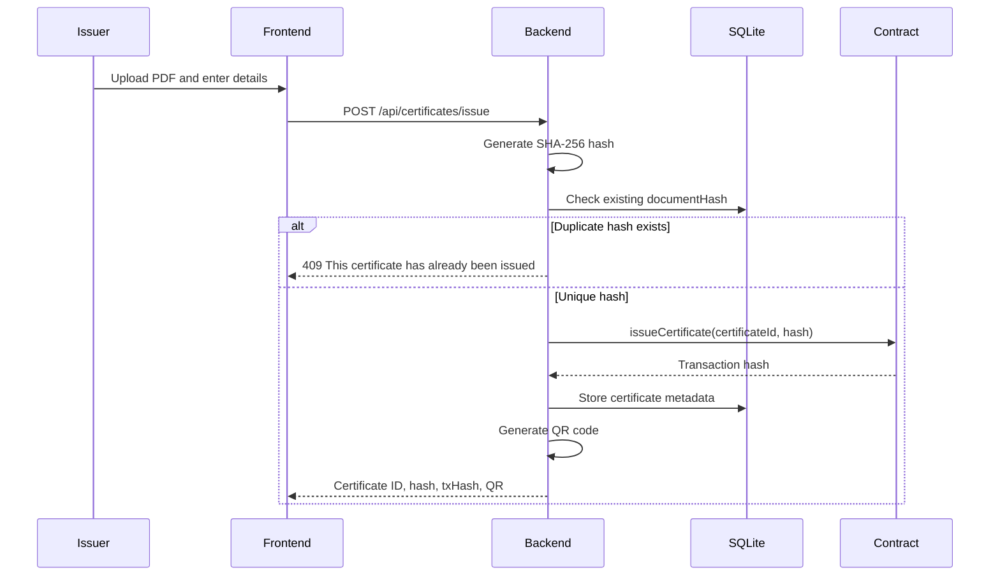
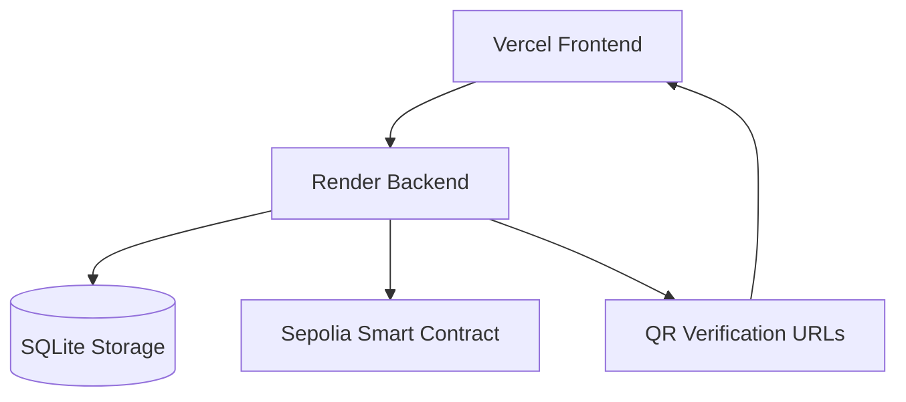

# CertChain

**Blockchain-powered certificate issuance, verification, and revocation platform**

[](https://react.dev/)
[](https://expressjs.com/)
[](https://ethereum.org/)
[](https://www.sqlite.org/)
[](https://vercel.com/)

## Elevator Pitch

CertChain is a full-stack Web3 certificate management platform that lets institutions issue tamper-evident PDF certificates, register document hashes on the Sepolia blockchain, verify authenticity through public links or QR codes, and revoke invalid certificates through an auditable blockchain-backed workflow.

## Live Demo

| Service | URL |
| --- | --- |
| Frontend | [https://yodaplus-poc.vercel.app/](https://yodaplus-poc.vercel.app/) |
| Backend API | [https://certchain-backend-hdf5.onrender.com](https://certchain-backend-hdf5.onrender.com) |
| Smart Contract | `0x1ea5879fB3E815DcC2018973c302B12C189639B4` |

## Project Overview

Academic and professional certificates are frequently shared as PDFs, screenshots, or printed documents. These formats are easy to duplicate, alter, or falsely claim. CertChain solves this by combining conventional web application workflows with blockchain-backed integrity guarantees.

The platform hashes each uploaded certificate PDF using SHA-256, stores the certificate metadata in SQLite, and registers the immutable document hash on a Solidity smart contract deployed to Sepolia. Anyone can verify a certificate by certificate ID, original PDF upload, or QR code scan.

## Problem Statement

Certificate fraud creates trust, compliance, and operational problems for universities, employers, training providers, and recruiters:

- PDFs can be edited without obvious visual signs.
- Manual verification is slow and often depends on institutional staff.
- Centralized records can be modified without public auditability.
- Recruiters and third parties need a fast way to validate credentials.
- Duplicate issuance of the same document can create conflicting certificate records.

## Solution

CertChain provides a lightweight MVP for verifiable digital credentials:

- Each PDF is converted into a SHA-256 hash.
- The hash is registered on-chain with a unique certificate ID.
- Metadata is stored in SQLite for application-level lookup.
- QR codes open a public verification route.
- Revocation is recorded through the smart contract and reflected in the UI.
- Duplicate document issuance is prevented using document hash uniqueness.

## Key Features

- Certificate issuance with PDF upload
- SHA-256 document hashing
- Blockchain-backed certificate registration
- Certificate verification by certificate ID
- Certificate verification by original PDF upload
- Public QR-based certificate verification
- Certificate revocation
- Duplicate certificate prevention using document hash uniqueness
- SQLite-backed certificate metadata storage
- React frontend dashboard
- Node.js REST API backend
- Solidity smart contract on Sepolia
- Vercel frontend deployment
- Render backend deployment

## Technology Stack

| Layer | Technology | Purpose |
| --- | --- | --- |
| Frontend | React + Vite | Responsive certificate dashboard and public verification UI |
| Styling | Tailwind CSS | Modern, utility-first interface styling |
| Routing | React Router | Page navigation and QR verification route handling |
| API Client | Axios | HTTP requests from frontend to backend |
| Backend | Node.js + Express | REST API, file handling, verification orchestration |
| Database | SQLite | Certificate metadata and local persistence |
| File Uploads | multer | Multipart PDF upload handling |
| Hashing | SHA-256 | Document integrity fingerprinting |
| QR Codes | qrcode | Base64 QR generation for verification URLs |
| Blockchain | Solidity | On-chain certificate registry |
| Development | Hardhat | Smart contract compilation, testing, and deployment |
| Web3 | ethers.js | Backend-to-contract interaction |
| Network | Sepolia Testnet | Public Ethereum testnet deployment |
| Hosting | Vercel + Render | Frontend and backend production deployment |

## System Architecture



## Project Structure

```text
Yodaplus-POC/
├── backend/
│   └── src/
│       ├── abi/
│       ├── config/
│       ├── controllers/
│       ├── middleware/
│       ├── routes/
│       ├── services/
│       ├── uploads/
│       ├── utils/
│       ├── app.js
│       └── server.js
├── blockchain/
│   ├── contracts/
│   ├── scripts/
│   ├── test/
│   └── hardhat.config.js
├── frontend/
│   ├── public/
│   ├── src/
│   │   ├── api/
│   │   ├── components/
│   │   ├── hooks/
│   │   ├── layouts/
│   │   ├── pages/
│   │   ├── routes/
│   │   ├── services/
│   │   └── utils/
│   ├── vercel.json
│   └── vite.config.js
└── README.md
```

## How It Works

1. An issuer uploads a certificate PDF and enters recipient details.
2. The backend validates the PDF and generates a SHA-256 document hash.
3. The backend checks SQLite to prevent duplicate issuance of the same PDF hash.
4. The certificate ID and hash are registered on the Sepolia smart contract.
5. Certificate metadata is stored in SQLite.
6. A QR code is generated with a public verification URL.
7. Verifiers can validate the certificate by ID, PDF upload, or QR scan.
8. If a certificate is revoked, the smart contract state marks it as invalid.

## Smart Contract Overview

The Solidity smart contract acts as the immutable trust layer for certificate records.

Core responsibilities:

- Issue a certificate with a unique certificate ID and document hash.
- Store issuer address and blockchain timestamp.
- Verify whether a certificate exists and whether it is revoked.
- Revoke a certificate through an on-chain transaction.

Deployed contract:

```text
0x1ea5879fB3E815DcC2018973c302B12C189639B4
```

Network:

```text
Sepolia Testnet
```

## Backend Architecture

The backend is an Express API that coordinates file uploads, hashing, persistence, QR generation, and blockchain calls.

Key backend modules:

| Module | Responsibility |
| --- | --- |
| `routes/certificateRoutes.js` | Defines certificate issue, verify, and revoke endpoints |
| `controllers/certificateController.js` | Handles request validation and business flow |
| `middleware/uploadMiddleware.js` | Accepts PDF uploads through multer |
| `services/hashService.js` | Generates SHA-256 hashes for uploaded PDFs |
| `services/blockchainService.js` | Uses ethers.js to call the smart contract |
| `services/qrService.js` | Generates base64 QR codes for verification links |
| `config/db.js` | Initializes SQLite and certificate table schema |

## Frontend Architecture

The frontend is a React + Vite application with a clean dashboard-style MVP interface.

Key frontend areas:

| Area | Responsibility |
| --- | --- |
| `pages/IssueCertificate.jsx` | Certificate issuance form, upload progress, success card, QR display |
| `pages/VerifyCertificate.jsx` | Manual verification, PDF verification, and QR route auto-verification |
| `pages/RevokeCertificate.jsx` | Admin-style revocation workflow |
| `services/certificateService.js` | Centralized certificate API calls |
| `api/api.js` | Axios instance and backend base URL |
| `components/` | Reusable UI components such as buttons, cards, inputs, QR card, loader |
| `routes/AppRoutes.jsx` | React Router route definitions |

## Certificate Issuance Workflow



## Certificate Verification Workflow

CertChain supports both ID-based and PDF-based verification.

### ID-Based Verification

1. User enters a certificate ID.
2. Backend fetches the certificate from SQLite.
3. Backend verifies the certificate state on-chain.
4. Frontend displays valid, invalid, or revoked status.

### PDF-Based Verification

1. User uploads the original certificate PDF.
2. Backend hashes the uploaded PDF.
3. Backend searches SQLite by `documentHash`.
4. If found, backend verifies the certificate on-chain.
5. Frontend displays certificate details and blockchain status.

## QR Verification Workflow

Each issued certificate receives a QR code containing a public verification URL:

```text
https://yodaplus-poc.vercel.app/verify/<certificate-id>
```

When scanned:

1. The QR code opens the frontend verification route.
2. React Router extracts the certificate ID from the URL.
3. The frontend automatically calls the verification API.
4. The verification result is displayed without manual input.

## Duplicate Certificate Prevention

CertChain prevents the same PDF from being issued multiple times, even if different recipient details are submitted.

Implementation:

- The backend generates a SHA-256 hash of the uploaded PDF.
- Before blockchain registration, SQLite is queried for an existing `documentHash`.
- If the hash exists, the API returns HTTP `409 Conflict`.
- The database schema also enforces uniqueness for `documentHash`.

Duplicate response:

```json
{
  "success": false,
  "message": "This certificate has already been issued"
}
```

## Why Blockchain?

CertChain uses blockchain where it adds clear business value: integrity, timestamping, and public auditability.

| Need | Blockchain Benefit |
| --- | --- |
| Tamper evidence | Certificate hashes cannot be silently modified after registration |
| Public verification | Third parties can validate certificate state without trusting a private database alone |
| Audit trail | Issuance and revocation are recorded as transactions |
| Issuer accountability | On-chain issuer address is associated with certificate actions |
| Revocation integrity | Revoked certificates remain historically visible but invalid |

The PDF itself is not stored on-chain. Only the document hash and certificate state are registered, keeping the system lightweight and privacy-conscious.

## Blockchain Integration

The backend uses `ethers.js` to interact with the deployed `CertificateRegistry` smart contract.

Main blockchain operations:

- `issueCertificate(certificateId, documentHash)`
- `verifyCertificate(certificateId)`
- `revokeCertificate(certificateId)`

The backend stores transaction hashes in SQLite so the frontend can display blockchain transaction references alongside certificate details.

## API Overview

| Method | Endpoint | Description | Payload |
| --- | --- | --- | --- |
| `GET` | `/api/certificates` | Certificate route health check | None |
| `POST` | `/api/certificates/issue` | Issue a certificate | `multipart/form-data` with `pdf`, `recipientName`, `course`, `institutionName` |
| `POST` | `/api/certificates/verify` | Verify certificate by uploaded PDF | `multipart/form-data` with `pdf` |
| `GET` | `/api/certificates/verify/:certificateId` | Verify certificate by ID | URL parameter |
| `POST` | `/api/certificates/revoke/:certificateId` | Revoke a certificate | URL parameter |

## Security Model

CertChain combines application-layer validation with blockchain-backed integrity.

- PDF uploads are handled through controlled multipart endpoints.
- Document identity is based on SHA-256 hashing.
- Duplicate document issuance is blocked by hash lookup and database uniqueness.
- Certificate authenticity is verified against smart contract state.
- Revoked certificates remain discoverable but are marked invalid.
- QR codes contain verification URLs, not private certificate data.
- Private keys and RPC URLs must be stored in environment variables.
- The original PDF is not stored on-chain.

## Security Considerations

- Never commit private keys or RPC credentials to source control.
- Use separate wallets for development, testnet, and production environments.
- Rotate compromised keys immediately.
- Restrict administrative revocation capabilities in a production-grade release.
- Validate all uploaded files and enforce upload size limits.
- Use HTTPS for production frontend and backend deployments.
- Monitor blockchain transaction failures and backend API errors.
- Back up the SQLite database if used beyond MVP or demo environments.

## Local Development Setup

### Prerequisites

- Node.js 18+
- npm
- Git
- Sepolia RPC endpoint
- Sepolia-funded wallet for contract transactions

### 1. Clone the Repository

```bash
git clone <repository-url>
cd Yodaplus-POC
```

### 2. Backend Setup

```bash
cd backend
npm install
npm run dev
```

Default local backend:

```text
http://localhost:5000
```

### 3. Frontend Setup

```bash
cd frontend
npm install
npm run dev
```

Default local frontend:

```text
http://localhost:5173
```

### 4. Blockchain Setup

```bash
cd blockchain
npm install
npx hardhat test
```

To deploy to Sepolia, configure blockchain environment variables and run the project deployment script used in the `blockchain` workspace.

## Environment Variables

### Backend `.env`

```env
PORT=5000
SEPOLIA_RPC_URL=<your-sepolia-rpc-url>
PRIVATE_KEY=<your-wallet-private-key>
CONTRACT_ADDRESS=0x1ea5879fB3E815DcC2018973c302B12C189639B4
FRONTEND_URL=http://localhost:5173
```

### Frontend `.env`

```env
VITE_API_BASE_URL=http://localhost:5000/api
```

For production, the frontend points to the Render backend:

```env
VITE_API_BASE_URL=https://certchain-backend-hdf5.onrender.com/api
```

### Blockchain `.env`

```env
SEPOLIA_RPC_URL=<your-sepolia-rpc-url>
PRIVATE_KEY=<your-wallet-private-key>
```

## Smart Contract Deployment Information

| Field | Value |
| --- | --- |
| Contract | `CertificateRegistry` |
| Network | Sepolia Testnet |
| Address | `0x1ea5879fB3E815DcC2018973c302B12C189639B4` |
| Tooling | Hardhat |
| Web3 Library | ethers.js |

## Production Deployment

| Component | Platform | URL |
| --- | --- | --- |
| Frontend | Vercel | [https://yodaplus-poc.vercel.app/](https://yodaplus-poc.vercel.app/) |
| Backend | Render | [https://certchain-backend-hdf5.onrender.com](https://certchain-backend-hdf5.onrender.com) |
| Smart Contract | Sepolia | `0x1ea5879fB3E815DcC2018973c302B12C189639B4` |

Production flow:



## Screenshots

Add project screenshots in this section for portfolio and showcase submissions.

### Landing Page

```text
Screenshot placeholder: CertChain landing page
```

### Issue Certificate

```text
Screenshot placeholder: Certificate issuance form and success QR card
```

### Verify Certificate

```text
Screenshot placeholder: Valid certificate verification result
```

### Revoke Certificate

```text
Screenshot placeholder: Certificate revocation workflow
```

## Future Enhancements

- Role-based issuer/admin authentication
- Institution profile management
- Certificate PDF generation from templates
- Email delivery for issued certificates
- IPFS or decentralized storage support for optional document anchoring
- Blockchain explorer links for transaction hashes
- Batch certificate issuance
- Advanced analytics dashboard
- Multi-chain support
- Production database migration from SQLite to PostgreSQL
- Formal smart contract verification and audit workflow

## Resume-Worthy Project Highlights

- Built a full-stack Web3 certificate verification MVP using React, Node.js, Solidity, and ethers.js.
- Implemented SHA-256 document fingerprinting to detect PDF tampering.
- Integrated a deployed Sepolia smart contract for immutable certificate issuance and revocation.
- Designed QR-based public verification for recruiter-friendly credential validation.
- Added duplicate certificate prevention using document hash uniqueness.
- Implemented PDF upload verification by recomputing document hash and matching against stored records.
- Delivered production deployment with Vercel frontend and Render backend.
- Structured the application with reusable frontend components and service-layer API abstraction.

## Business Value

CertChain helps institutions and verifiers reduce credential fraud, speed up validation, and create a transparent audit trail for issued and revoked certificates. It demonstrates how blockchain can be used pragmatically as a trust layer without storing private documents on-chain.

## Author

**CertChain MVP**  
Full-stack blockchain certificate verification project.

Add your name, portfolio, LinkedIn, and GitHub profile here before publishing as a public portfolio repository.

## License

This project is provided for educational, portfolio, and MVP demonstration purposes. Add a formal license such as MIT if you plan to distribute or open-source it publicly.
